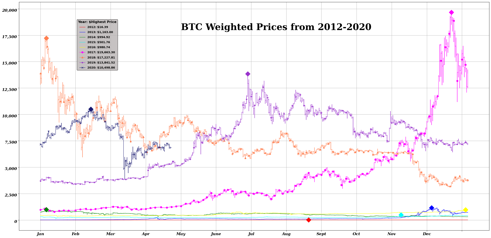

# BTC-historical-analysis
## analysis of BTC from 2012-2020
- constructed from Kaggle datasets
- shown below is an annual trend graph from 2012-2020, with labeled markers indicating each year's highest weighted price
- thoughts for further analysis: can find and map historical events/occurrences and assign weights to see which factors contribute to price fluctuations; can perform same for low prices 

